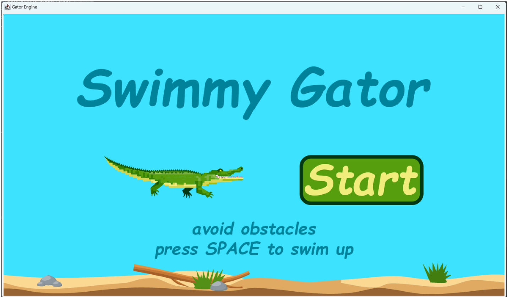

# Overview
   "Swimmy Gator" is a 2D side-scrolling game developed using a custom-built Gator engine. Players control a gator character by pressing the spacebar on the keyboard,
   navigating through an underwater environment while avoiding various obstacles. As the game progresses, the gator swims faster, making it increasingly challenging
   to avoid obstacles. The game features a timer, and the objective is to survive for as long as possible as the game speed gradually increases.<br>
<br>


# Prerequisites & Installation

This project is built entirely with **Java**. No external packages or libraries beyond the standard **Java Development Kit (JDK)** are required, as the game runs on the provided **Gator Engine** framework.

### To install and run the game:

1.  **Ensure Java is Installed:**
    *   You must have the **Java JDK (version 8 or higher)** installed on the system.
    *   You can verify this by opening a terminal and typing:
        ```bash
        java -version
        javac -version
        ```
    *   If these commands return version numbers, you are ready to proceed. If not, please download and install the JDK from [Oracle's website](https://www.oracle.com/java/technologies/downloads/) or use an OpenJDK distribution.
<br>

# Gameplay

Control an alligator, avoiding obstacles by jumping with the **SPACE BAR**. The game's speed increases over time, making survival increasingly challenging.
